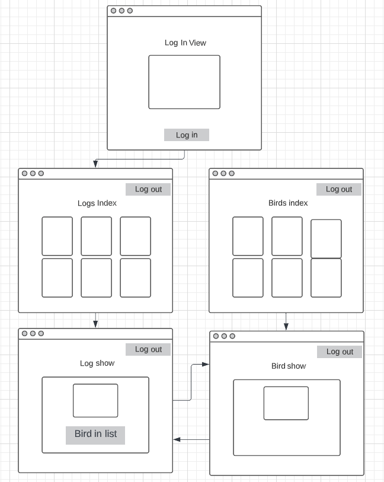

# Birbbook

A birb-spotter's log book. A convenient way to record, view and edit bird-watching expedition data. Access the Heroku-hosted app [here](https://birbbook.herokuapp.com/login).

Blessed with terrible memory, I have often found myself wanting a way to document bird sightings in a digital format so I can go back and relive the excitement at a later date. Enter Birbbook, a full stack app that allows user to log their sightings and build a database of common birds to draw from.

Built using:
 - HTML5, CSS, JavaScript front-end
 - Node.js, express, EJS (inc. partials)
 - MongoDB, Mongoose database manipulation
 - bcrypt password hashing
 - Multer & Cloudinary image uploads
 - Hosted on GitHub and Heroku

### CRUD App functionality

The idea was to build an app using the Models, Views, Controller (MVC) structure with at least one controller using a total of 7 RESTful routes. The function of a CRUD app is to be able to: 
 - Create, 
 - Read, 
 - Update and 
 - Delete information.

With this in mind, the 7 RESTful routes needed would be:
 - `GET` a collection
 - `NEW` addition to the collection
 - `SHOW` an existing resource
 - `POST` a new resource
 - `EDIT` a stored resource and
 - `PUT` that edited resource back into the collection

 My initial plan was to have 2 separate collections on a database, with a "one-to-few" connection between them. The `logs` database would contain a list of `birds`, which would be populated from the `birds` collection.

 I would also want some basic `user` and `session` functionality, although only one or two routes would be needed for these.

 In total I would need models, views and controllers for at least:
  - `Users`
  - `Sessions`
  - `Logs`
  - `Birds`

 I drew up a basic wireframe to plan how the routes would connect.

Access would be restricted by a log gate, meaning only a logged-in user would be able to view, edit and delete logs and birds on their respective collections.

### Features

Aside from the above basic functionality, there are some additional features including:

 - Mobile-first responsive design implementing a collapsing Burger menu for the navbar.
 - Bootstrap styling (in future I would default to creating my own CSS styling!).
 - Image upload and storing using `Multer` and `Cloudinary`.
 - Password hashing using `bcrypt`.
 - Data hosted on `MongoDB` and accessed using `Node.js` and `Mongoose`.
 - Routes aside from the basic `GET` and `POST` would be handled using `method-override` in express and mongoose.
 - Default image templates using [LoremFlickr](https://loremflickr.com/) if no user images are uploaded.

 ### Future additions

 There is some functionality I would like to build into the app, once I have some more skills under my belt.

 - A different way of displaying bird options through the `NEW` and `EDIT` routes. At the moment a rudimentary list of checkboxes is displayed (and populated!) but it is not easy on the eyes.

 - Perhaps an embedded Google Map with a bespoke collection of logs would help to display the collection in a different way, with the user being able to select logs based on geolocation.

 - Further styling and UX aside from the basic Bootstrap functionality.

### How to use

Run the app from the Heroku app at the top, or clone from this GitHub repo.
